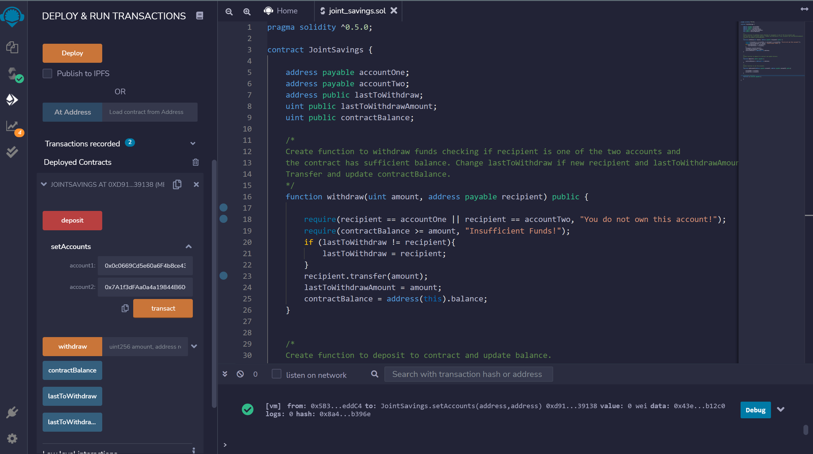
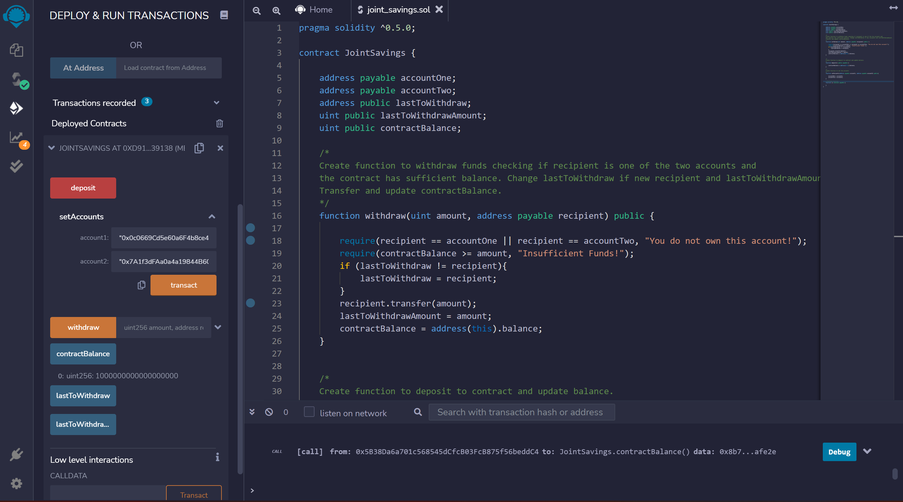
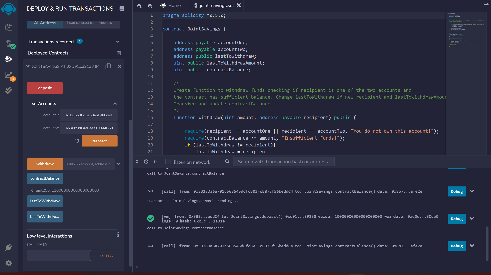
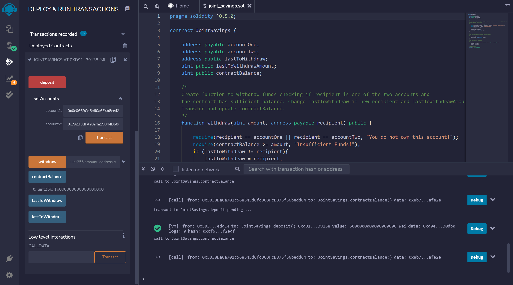
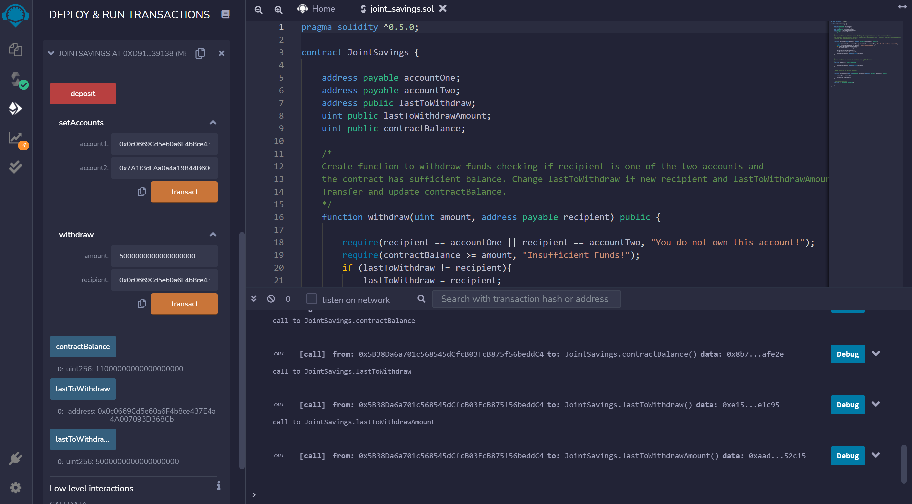
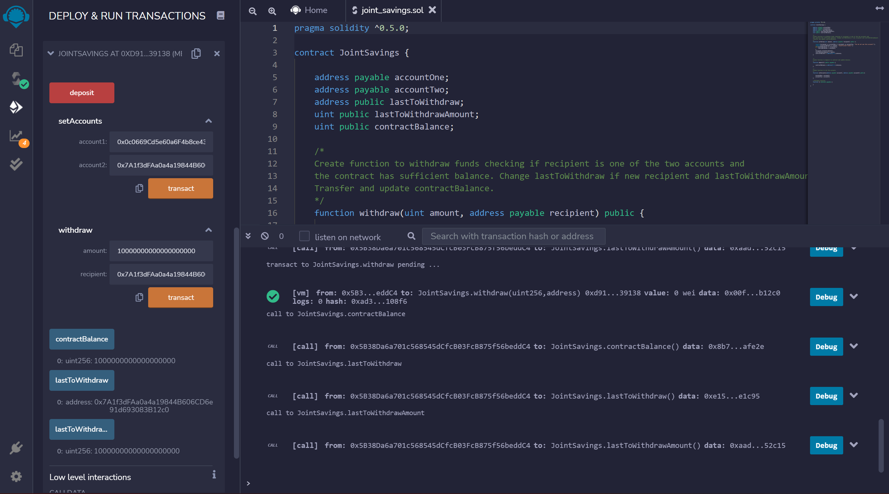

# Joint_Savings_ETH

This solidity contract is used to make saving ETH easier by allowing two addresses to deposit or withdraw funds from the contract.

---

## Technologies

This contract is created using solidity with the pragma ^0.5.0.

---

## Usage

This contract works as a saving account for two address to withdraw and deposit ETH. 

To test the contract simply compile the .sol file and run it on a test network. Find the area to set the addresses for the contract and then you can use the functions to deposit and withdraw funds. (Note: All values for depositing and withdrawing should be in wei. ETH * 10^18)

Here are some images and examples of the solidity contract in action:

An image of the contract being compiled.
 

An image of the contract being initialized and then the addresses for use are being set:
 

Images of funds being added to the contract notice the balance increasing each time (Note: The balance is in wei. So ETH * 10^18 = wei.):
 
 
 

Images of funds being withdrawn from the contract. Notice the balance decreasing each time:
 
 

---

## Contributors

Deep Patel -- Deep4Patel9@gmail.com

---

## License

MIT License

Copyright (c) 2022  

Permission is hereby granted, free of charge, to any person obtaining a copy
of this software and associated documentation files (the "Software"), to deal
in the Software without restriction, including without limitation the rights
to use, copy, modify, merge, publish, distribute, sublicense, and/or sell
copies of the Software, and to permit persons to whom the Software is
furnished to do so, subject to the following conditions:

The above copyright notice and this permission notice shall be included in all
copies or substantial portions of the Software.

THE SOFTWARE IS PROVIDED "AS IS", WITHOUT WARRANTY OF ANY KIND, EXPRESS OR
IMPLIED, INCLUDING BUT NOT LIMITED TO THE WARRANTIES OF MERCHANTABILITY,
FITNESS FOR A PARTICULAR PURPOSE AND NONINFRINGEMENT. IN NO EVENT SHALL THE
AUTHORS OR COPYRIGHT HOLDERS BE LIABLE FOR ANY CLAIM, DAMAGES OR OTHER
LIABILITY, WHETHER IN AN ACTION OF CONTRACT, TORT OR OTHERWISE, ARISING FROM,
OUT OF OR IN CONNECTION WITH THE SOFTWARE OR THE USE OR OTHER DEALINGS IN THE
SOFTWARE.
